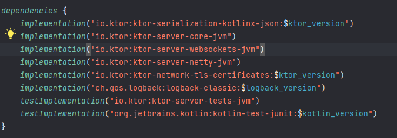
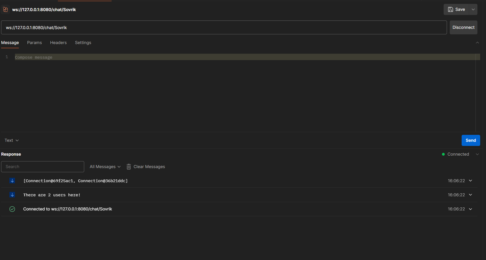
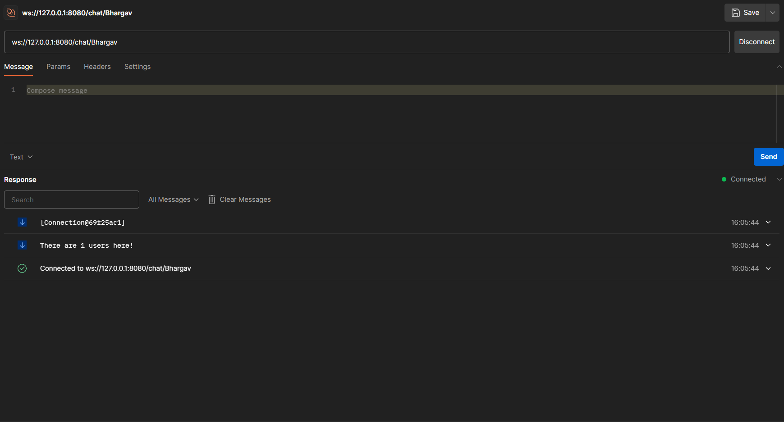
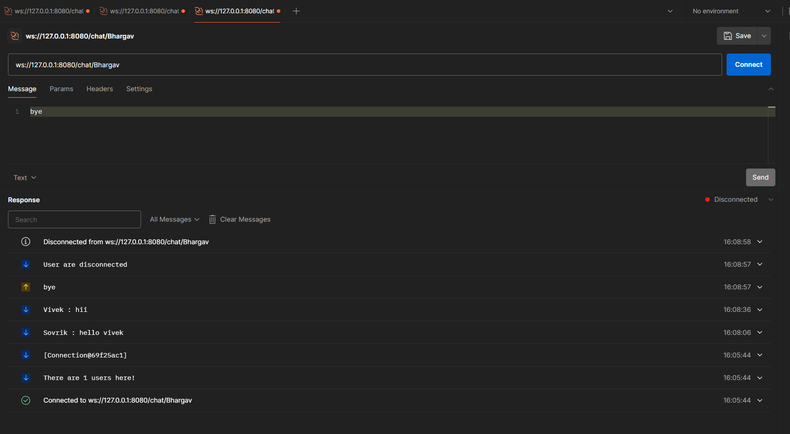

# WebSocket-Server

## Table of Contents
- [Introduction](#introduction)
- [Features](#features)
- [Technology](#technology)
- [Plugins](#plugins)
- [Examples](#examples)
- [Resource](#resource)
- [Todo](#todo)

## Introduction
This project is a WebSocket server implemented in Kotlin using Ktor. It allows real-time, bi-directional communication between the server and multiple clients. The server manages connections and broadcasts messages to all connected clients.

## Features
- Real-time communication using WebSocket protocol
- Handles multiple clients simultaneously
- Name-based user identification with duplicate name checks
- Automatic disconnection handling

## Technology
- ktor-client
- kotlin

## Plugins
- Kotlinx JSON Serialization: For JSON serialization and deserialization using Kotlinx.
- WebSockets: For WebSockets support in your Ktor server.

## Configuration
 #### The WebSocket server can be configured in the Application.configureSockets method. Key configuration options include:
  - pingPeriod: The interval at which ping frames are sent to maintain the connection. **(Duration 1000 Seconds)**
  - timeout: The maximum duration to wait for a pong response before closing the connection. **(Duration 1000 Seconds)**
  - maxFrameSize: The maximum size of a single WebSocket frame. **(Max_Value)**
  - masking: A boolean indicating whether to mask the WebSocket frames.

## Examples
|                                            |                                               |
|:------------------------------------------:|:----------------------------------------------|
|    |      |
|  |       |
|   |  |

## Resource

### [ktor Docs](#https://ktor.io/docs/server-websockets.html)

## Todo
 - Implement Authentication
 - Host the Websocket in the server

