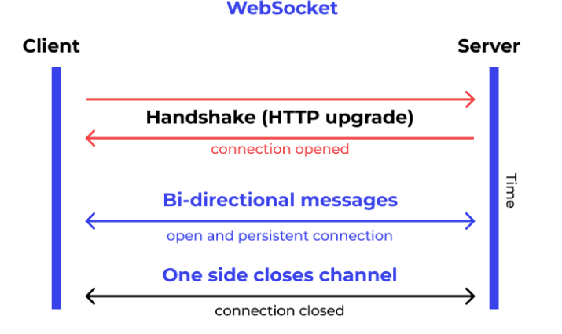

# WebSocket-Server

## Table of Contents
- [Introduction](#introduction)
- [Features](#features)
- [Installation](#installation)
- [Usage](#usage)
- [Configuration](#configuration)
- [Examples](#examples)
- [Contributing](#contributing)
- [License](#license)
- [Contact](#contact)

## Introduction
This project is a WebSocket server implemented in Kotlin using Ktor. It allows real-time, bi-directional communication between the server and multiple clients. The server manages connections and broadcasts messages to all connected clients.

## Features
- Real-time communication using WebSocket protocol
- Handles multiple clients simultaneously
- Name-based user identification with duplicate name checks
- Automatic disconnection handling

## Configuration
 #### The WebSocket server can be configured in the Application.configureSockets method. Key configuration options include:
  - pingPeriod: The interval at which ping frames are sent to maintain the connection. **(Duration 1000 Seconds)**
  - timeout: The maximum duration to wait for a pong response before closing the connection. **(Duration 1000 Seconds)**
  - maxFrameSize: The maximum size of a single WebSocket frame. **(Max_Value)**
  - masking: A boolean indicating whether to mask the WebSocket frames.

